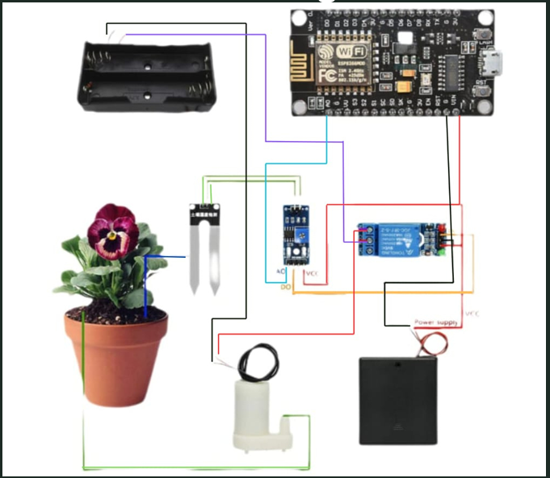

# 🌱 Soil Moisture Sensor-Based Smart Irrigation System

## 📖 Overview

The **Soil Moisture Sensor-Based Smart Irrigation System** is an IoT project designed to automate the irrigation process by monitoring soil moisture levels in real time. The system uses a **NodeMCU microcontroller**, **soil moisture sensor**, **relay module**, and **water pump** to ensure plants receive the required amount of water while minimizing water wastage.

This project promotes smart farming by improving irrigation efficiency, reducing manual intervention, and conserving water resources.

---

## 🎯 Objectives

* Monitor soil moisture continuously.
* Automate irrigation based on soil moisture levels.
* Reduce water wastage.
* Improve crop growth and agricultural productivity.
* Promote smart and sustainable farming practices.

---

## ⚙️ Hardware Components

* NodeMCU (ESP8266)
* Soil Moisture Sensor
* LM393 Comparator Module
* Relay Module
* DC Water Pump
* Battery Holder / Power Supply
* Jumper Wires

---

## 🛠️ Software

* Arduino IDE
* Embedded C / Arduino Programming

---

## 🔄 Working Principle

1. The soil moisture sensor detects the moisture content in the soil.
2. The sensor sends data to the NodeMCU.
3. The NodeMCU compares the moisture level with a predefined threshold.
4. If the soil is dry, the relay module activates the water pump.
5. Once sufficient moisture is detected, the relay turns OFF the pump automatically.

---

## ✨ Features

* Automatic irrigation
* Real-time soil moisture monitoring
* Water conservation
* Easy to install
* Low-cost IoT solution
* Reduced manual effort

---

## 🌾 Applications

* Smart Agriculture
* Home Gardens
* Greenhouses
* Precision Farming
* Plant Monitoring Systems

---

## 🚀 Future Enhancements

* Mobile application for remote monitoring
* Cloud-based data storage
* Weather-based irrigation scheduling
* AI-powered irrigation prediction
* Integration with multiple sensors

---

## 💡 Advantages

* Efficient water usage
* Prevents overwatering
* Improves crop yield
* Reduces soil erosion
* Saves energy
* Supports sustainable agriculture

---

## 🧰 Technologies Used

* Internet of Things (IoT)
* NodeMCU (ESP8266)
* Arduino IDE
* Embedded C
* Soil Moisture Sensor
* Relay Control System

---

## Circuit Diagram

---

## 📜 License

This project is developed for educational and academic purposes.

---

⭐ If you found this project useful, consider giving this repository a star!
